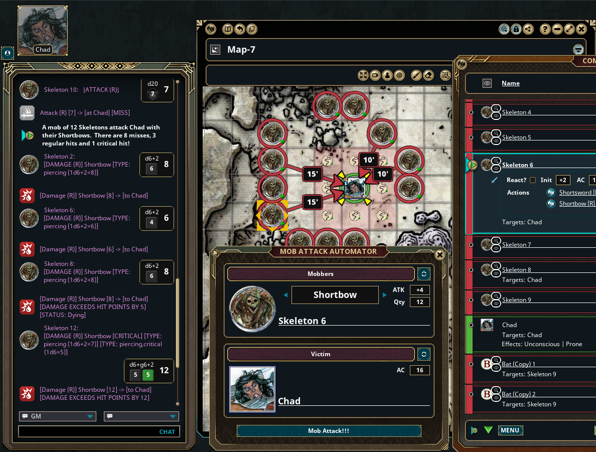

# Mob Attack Automator

A mod for Fantasy Grounds that will automate multiple NPC attack rolls against a single target.  Useful for mobs of critters, or squads of archers; instead of using some kind of statistical indexing as suggested elsewhere.


## Installation

 - Download the latest version
```
 cd <fantasy_grounds_data_dir>/extensions
 git clone https://github.com/mlheur/mob-attack-automator
```
 - Enable the extension "mob-attack-automator" when creating or loading a campaign.

## Screenshot
